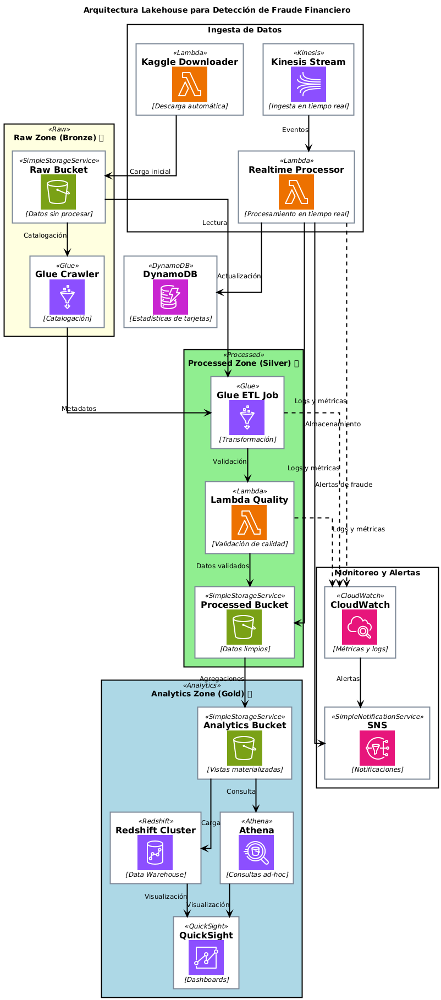

# 🛡️ Proyecto de Detección de Fraude Financiero con Terraform

[](https://aws.amazon.com/)
[](https://www.terraform.io/)
[](https://www.kaggle.com/c/ieee-fraud-detection)
[](LICENSE)

Este proyecto implementa un sistema completo de ingeniería de datos para detección de fraude financiero en AWS, utilizando Terraform para la infraestructura como código. El sistema está diseñado siguiendo una arquitectura Lakehouse con tres zonas de datos y componentes para procesamiento por lotes y en tiempo real.

## 📋 Tabla de Contenidos

- [Arquitectura del Sistema](#-arquitectura-del-sistema)
- [Dataset](#-dataset)
- [Estructura del Proyecto](#-estructura-del-proyecto)
- [Requisitos Previos](#-requisitos-previos)
- [Guía de Instalación](#-guía-de-instalación)
- [Componentes Principales](#-componentes-principales)
- [Escalabilidad y Rendimiento](#-escalabilidad-y-rendimiento)
- [Documentación Detallada](#-documentación-detallada)
- [Licencia](#-licencia)
- [Contacto](#-contacto)

## 🏗️ Arquitectura del Sistema



El sistema sigue una arquitectura Lakehouse en AWS con tres zonas principales:

### Raw Zone (Bronze) 🥉
- **Propósito**: Almacenamiento de datos sin procesar
- **Implementación**: Bucket S3 con catalogación mediante Glue Crawler
- **Formato**: Original (CSV) o Parquet con compresión
- **Características**: Inmutabilidad, retención configurable, particionamiento por fecha

### Processed Zone (Silver) 🥈
- **Propósito**: Datos limpios y transformados
- **Implementación**: Bucket S3 con modelo estrella implementado
- **Procesamiento**: ETL gestionado con AWS Glue
- **Características**: Validación de calidad, normalización, enriquecimiento

### Analytics Zone (Gold) 🥇
- **Propósito**: Vistas materializadas para análisis
- **Implementación**: Bucket S3 + Redshift (en prod)
- **Visualización**: Integración con QuickSight
- **Características**: Optimización para consultas, agregaciones, métricas

### Flujo de Datos

```
Ingesta → Raw Zone → Procesamiento → Processed Zone → Análisis → Analytics Zone
   ↑                     ↑                                 ↓
Tiempo Real         Batch (Glue)                      Dashboards
(Kinesis)                                            (QuickSight)
```

Para una vista más detallada del flujo de datos, consulta el [diagrama de flujo completo](docs/diagrams/data_flow.png).

## 📊 Dataset

El proyecto utiliza el dataset **IEEE-CIS Fraud Detection** disponible en Kaggle, que contiene más de 1 millón de registros de transacciones financieras con etiquetas de fraude verificadas.

### Características del Dataset

- **Tamaño**: >1 millón de registros
- **Archivos**:
  - `identity_*.csv`: Información de identidad de los usuarios (~140MB)
  - `transaction_*.csv`: Información de las transacciones financieras (~590MB)
- **Variables**: Más de 400 características, muchas anónimas por confidencialidad
- **Etiquetas**: Clasificación binaria (fraude/no fraude)

### Descarga Automática

El proyecto incluye un sistema automatizado para descargar el dataset directamente desde Kaggle y cargarlo en el bucket S3 Raw, eliminando la necesidad de descarga manual.

## 📁 Estructura del Proyecto

```
.
├── main.tf                 # Archivo principal de Terraform
├── variables.tf            # Definición de variables
├── outputs.tf              # Salidas del proyecto
├── terraform.tfvars        # Valores de las variables
├── modules/                # Módulos de Terraform
│   ├── storage/            # Módulo para S3 buckets
│   ├── processing/         # Módulo para Glue, Lambda, Kinesis
│   ├── analytics/          # Módulo para Redshift, Athena
│   ├── security/           # Módulo para IAM roles y políticas
│   ├── monitoring/         # Módulo para CloudWatch y SNS
│   └── data_ingestion/     # Módulo para descarga de datos de Kaggle
├── scripts/                # Scripts para Glue y Lambda
│   ├── glue/               # Scripts de ETL para Glue
│   ├── lambda/             # Funciones Lambda
│   ├── create_kaggle_layer.sh  # Script para crear capa Lambda
│   └── trigger_kaggle_download.sh  # Script para ejecutar descarga manual
└── docs/                   # Documentación adicional
    └── architecture.png    # Diagrama de arquitectura
```

## 🔧 Requisitos Previos

- [Terraform](https://www.terraform.io/downloads.html) v1.2.0 o superior
- [AWS CLI](https://aws.amazon.com/cli/) configurado con credenciales adecuadas
- [Python](https://www.python.org/downloads/) 3.9 o superior (para scripts locales)
- [Cuenta de Kaggle](https://www.kaggle.com/) con API key para descarga automática
- [Git](https://git-scm.com/downloads) para clonar el repositorio

## 🚀 Guía de Instalación

### 1. Clonar el Repositorio

```bash
git clone https://github.com/Leonsang/fraud-detection-terraform.git
cd fraud-detection-terraform
```

### 2. Configurar Credenciales de AWS

```bash
export AWS_ACCESS_KEY_ID="tu_access_key"
export AWS_SECRET_ACCESS_KEY="tu_secret_key"
export AWS_DEFAULT_REGION="us-east-1"
```

En Windows PowerShell:

```powershell
$env:AWS_ACCESS_KEY_ID="tu_access_key"
$env:AWS_SECRET_ACCESS_KEY="tu_secret_key"
$env:AWS_DEFAULT_REGION="us-east-1"
```

### 3. Personalizar Variables

Revisa y modifica los valores en `terraform.tfvars` según tus necesidades:

```hcl
# Configuración general
aws_region   = "us-east-1"
project_name = "fraud-detection"
environment  = "dev"  # Cambia a "test" o "prod" según sea necesario

# Configuración de Kaggle
kaggle_username = "tu_usuario_kaggle"  # Reemplazar con tu usuario de Kaggle
kaggle_key      = "tu_api_key_kaggle"  # Reemplazar con tu API key de Kaggle
```

### 4. Configurar Credenciales de Kaggle

Para la descarga automática del dataset IEEE-CIS Fraud Detection:

1. Crea una cuenta en [Kaggle](https://www.kaggle.com/) si aún no tienes una
2. Ve a tu perfil > Account > API > Create New API Token
3. Esto descargará un archivo `kaggle.json` con tus credenciales
4. Actualiza los valores en `terraform.tfvars` como se muestra arriba

### 5. Crear la Capa Lambda para Kaggle

```bash
# Dar permisos de ejecución al script
chmod +x scripts/create_kaggle_layer.sh

# Ejecutar el script
./scripts/create_kaggle_layer.sh
```

### 6. Inicializar y Aplicar Terraform

```bash
# Inicializar Terraform
terraform init

# Crear un plan de ejecución
terraform plan -out=tfplan

# Aplicar la configuración
terraform apply tfplan
```

### 7. Ejecutar la Descarga de Datos Manualmente (opcional)

```bash
# Dar permisos de ejecución al script
chmod +x scripts/trigger_kaggle_download.sh

# Ejecutar el script (reemplaza con el nombre real de la función Lambda)
./scripts/trigger_kaggle_download.sh fraud-detection-dev-kaggle-downloader
```

### 8. Monitorear el Pipeline

Puedes monitorear el estado del pipeline a través de:

- **AWS Console**: CloudWatch Dashboard
- **CLI**: 
  ```bash
  # Ver estado del job de Glue
  aws glue get-job-runs --job-name fraud-detection-dev-etl-job
  
  # Ver logs de la función Lambda
  aws logs get-log-events --log-group-name /aws/lambda/fraud-detection-dev-kaggle-downloader --log-stream-name $(aws logs describe-log-streams --log-group-name /aws/lambda/fraud-detection-dev-kaggle-downloader --query 'logStreams[0].logStreamName' --output text)
  ```

### 9. Destruir la Infraestructura (cuando ya no se necesite)

```bash
terraform destroy
```

## 🧩 Componentes Principales

### Almacenamiento (Storage) 💾
- **Buckets S3**: Zonas Raw, Processed y Analytics
- **Características**: Cifrado en reposo, versionado, ciclo de vida
- **Particionamiento**: Por fecha para optimizar consultas

### Procesamiento (Processing) ⚙️
- **ETL**: Jobs de AWS Glue para transformación de datos
- **Catalogación**: Crawlers de Glue para metadatos
- **Tiempo Real**: Stream de Kinesis + Lambda
- **Validación**: Funciones Lambda para calidad de datos
- **Estadísticas**: Tabla DynamoDB para métricas de tarjetas

### Analítica (Analytics) 📈
- **Data Warehouse**: Cluster de Redshift (solo en prod)
- **Consultas Ad-hoc**: Workgroup de Athena
- **Visualización**: Dashboards en QuickSight

### Seguridad (Security) 🔒
- **IAM**: Roles con privilegios mínimos
- **Cifrado**: KMS para datos sensibles
- **Acceso**: Políticas granulares por servicio

### Monitoreo (Monitoring) 📊
- **Métricas**: Dashboard de CloudWatch
- **Alertas**: Alarmas para errores y anomalías
- **Notificaciones**: Integración con SNS para emails

## 📈 Escalabilidad y Rendimiento

El sistema está diseñado para escalar según las necesidades:

### Escenario: Incremento de datos en 100x
- S3 escala automáticamente para almacenamiento
- Particionamiento optimizado para consultas eficientes
- Escalado de Glue con trabajadores adicionales
- Redshift con más nodos para análisis (en prod)

### Escenario: Ejecución en ventanas de tiempo específicas
- Programación precisa con CloudWatch Events
- Monitoreo reforzado durante ventanas críticas
- Reintentos automáticos para garantizar completitud

### Escenario: Acceso por más de 100 usuarios
- Redshift con escalado de concurrencia
- Athena para consultas distribuidas
- Capa de API con API Gateway para acceso programático
- Políticas de caché para consultas frecuentes

### Escenario: Analítica en tiempo real
- Procesamiento de streams con Kinesis
- Detección de fraude en tiempo real con Lambda
- Alertas inmediatas vía SNS
- Dashboards actualizados en tiempo real

## 📚 Documentación Detallada

Para más información, consulta nuestra documentación detallada:

### Guías de Configuración
- [Guía de Instalación y Ejecución](docs/setup/SETUP_GUIDE.md)
- [Guía de Git](docs/setup/GIT_GUIDE.md)

### Documentación Técnica
- [Detalles Técnicos del Sistema](docs/technical/TECHNICAL_DETAILS.md)
- [Estructura del Proyecto](docs/technical/PROJECT_STRUCTURE.md)

### Contexto del Proyecto
- [Contexto de la Prueba Técnica](docs/context/TECHNICAL_TEST_CONTEXT.md)
- [Cumplimiento de Requisitos](docs/context/TECHNICAL_TEST_COMPLIANCE.md)

### Diagramas
- [Arquitectura del Sistema](docs/diagrams/architecture.png)
- [Flujo de Datos](docs/diagrams/data_flow.png)

Para un índice completo de la documentación, consulta el [índice de documentación](docs/README.md).

## 📄 Licencia

Este proyecto está licenciado bajo la Licencia MIT - ver el archivo [LICENSE](LICENSE) para más detalles.

## 📞 Contacto

Para preguntas o sugerencias, por favor abre un issue en este repositorio o contacta al equipo de desarrollo.

---

⭐ **¿Te gusta este proyecto?** ¡Dale una estrella en GitHub!
