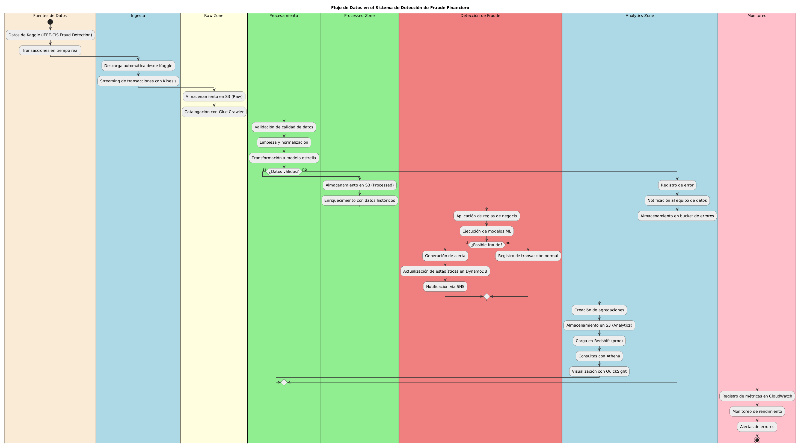

# 📚 Documentación del Proyecto de Detección de Fraude

## 📂 Estructura de la Documentación

### 📖 Guías de Configuración (`/setup`)
- [Guía de Instalación y Ejecución](setup/SETUP_GUIDE.md)
- [Guía de Git](setup/GIT_GUIDE.md)

### 🔧 Documentación Técnica (`/technical`)
- [Detalles Técnicos](technical/TECHNICAL_DETAILS.md)
- [Estructura del Proyecto](technical/PROJECT_STRUCTURE.md)

### 📋 Contexto del Proyecto (`/context`)
- [Contexto de la Prueba Técnica](context/TECHNICAL_TEST_CONTEXT.md)
- [Cumplimiento de Requisitos](context/TECHNICAL_TEST_COMPLIANCE.md)

### 📊 Diagramas (`/diagrams`)
- [Arquitectura del Sistema](diagrams/architecture.png)
- [Flujo de Datos](diagrams/data_flow.png)

## 🔍 Guía Rápida

1. **Para Comenzar**
   - Revisa la [Guía de Instalación](setup/SETUP_GUIDE.md) para configurar el proyecto
   - Sigue la [Guía de Git](setup/GIT_GUIDE.md) para gestionar el código

2. **Entendimiento del Proyecto**
   - Lee el [Contexto de la Prueba Técnica](context/TECHNICAL_TEST_CONTEXT.md)
   - Revisa los [Detalles Técnicos](technical/TECHNICAL_DETAILS.md)

3. **Implementación**
   - Consulta la [Estructura del Proyecto](technical/PROJECT_STRUCTURE.md)
   - Verifica el [Cumplimiento de Requisitos](context/TECHNICAL_TEST_COMPLIANCE.md)

## 📈 Diagramas Principales

### Arquitectura del Sistema


### Flujo de Datos


## 🔄 Mantenimiento de la Documentación

La documentación se mantiene actualizada siguiendo estas pautas:
1. Todos los cambios técnicos deben reflejarse en la documentación correspondiente
2. Los diagramas se actualizan cuando hay cambios en la arquitectura
3. Las guías de configuración se revisan con cada release
4. El cumplimiento de requisitos se verifica periódicamente

## Contenido

- `architecture.puml` - Código fuente del diagrama de arquitectura en formato PlantUML
- `architecture.png` - Imagen del diagrama de arquitectura (marcador de posición)
- `architecture.png.txt` - Representación ASCII del diagrama de arquitectura
- `architecture.md` - Instrucciones para generar el diagrama de arquitectura

## Generación de Imágenes

Para generar las imágenes necesarias para la documentación, sigue las instrucciones en `architecture.md`.

## Imágenes Adicionales

Si necesitas añadir más imágenes a la documentación, colócalas en este directorio y referéncialas en los archivos Markdown usando rutas relativas:

```markdown

```

## Actualización de Imágenes

Para actualizar una imagen existente:

1. Modifica el archivo fuente correspondiente (por ejemplo, `architecture.puml`)
2. Genera la nueva imagen siguiendo las instrucciones
3. Reemplaza la imagen existente con la nueva versión
4. Actualiza la documentación si es necesario

## Estructura Recomendada para Nuevas Imágenes

- Usa nombres descriptivos para los archivos
- Incluye archivos fuente cuando sea posible (diagramas, etc.)
- Mantén un tamaño razonable para las imágenes (máximo 1200px de ancho)
- Usa formatos PNG para diagramas y capturas de pantalla
- Incluye texto alternativo en las referencias para accesibilidad 